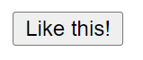
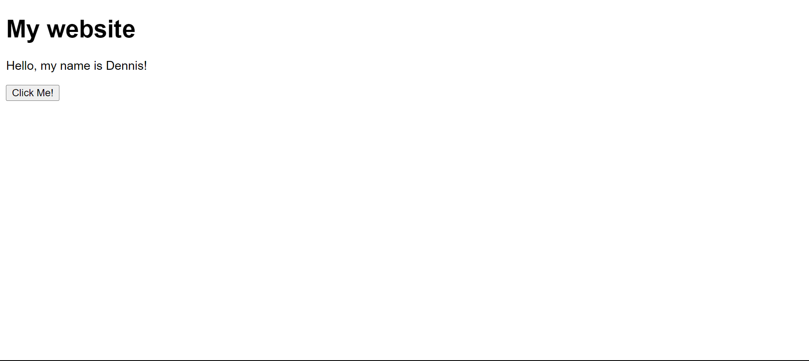

# The full introduction to Web Development.

Making websites seems cool and coding them is really fun once you get the hang of it!
In this lesson we'll go over an introduction to web development.

# The Basics

Open your code editor, if you don't have one I recommend **[Visual Studio Code](https://code.visualstudio.com/)**.
After you have your code editor open, create 3 files! `index.html`, `style.css`, and `script.js`!

It should look like this now:

> Visual Studio Code. — *Default theme, default icons*

Let's enter some **boilerplate code** into our `index.html` file.
```html
<!DOCTYPE html>
<html lang="en">
<head>
    <meta charset="UTF-8">
    <meta name="viewport" content="width=device-width, initial-scale=1.0">
    <title>Document</title>
</head>
<body>

</body>
</html>
```

Replace the contents inside of  `<title>` with the title of your page, for example:
```html
<title>My website</title>
```


# Your html body.

The `<body>` is one of the most important elements in **HTML**! It's where you place all your contents you want people to see, it's basically your canvas 😄

To make *big* text otherwise known as a **header** use the
* `<h1>`
* `<h2>`
* `<h3>`
* `<h4>`
* `<h5>`
* `<h6>`
I recommend you use `<h1>` mostly. Add `<h1>My website</h1>` to your body:
```html
<body>
<h1>My website</h1>
</body>
```


> Your page will now look like *this*

To create a button use `<button></button>` to create text in your button put text inbetween your button element tags, `<button>Like this!</button>` 

It looks super bland and boring right now 🫤
I'll upload a lesson on styling your **HTML** later on.

For now I'll make my button say "Click Me!" :D
`<button>Click Me!</button>`


Let's add some text to our **HTML** page using the `<p>` element.
Our code is now:
```html
<!DOCTYPE html>
<html lang="en">
<head>
    <meta charset="UTF-8">
    <meta name="viewport" content="width=device-width, initial-scale=1.0">
    <title>My website</title>
</head>
<body>
    <h1>My website</h1>
    <p>Hello, my name is Dennis!</p>
    <button>Click Me!</button>
</body>
</html>
```

# Adding action to our button.

Let's add action to our button with **JavaScript**. Remember that `script.js` file? Let's create a function for our button!
Write in your file the following code:
```javascript
function mybutton() {
	window.alert("Hi!")
}
```
To add the function to your button:
```html
    <button onclick="mybutton()">Click Me!</button>
    <script src="script.js"></script>
```


This is how your website will look when you click the button!

# Styling.

Remember that `style.css` file? Well, let's use that!
In the top of your **HTML** file, in `<head>` your entire `<head>` element should be:
```html
<head>
    <link rel="stylesheet" href="style.css">
    <meta charset="UTF-8">
    <meta name="viewport" content="width=device-width, initial-scale=1.0">
    <title>My website</title>
</head>
```

That `<link rel="stylesheet" href="style.css">` will link the **CSS** file to your **HTML** file.
In your **CSS** file write:
```css
body {
	font-family:sans-serif;
}
```

Your website looks like this now! Remember when I said that your button is boring and bland? Enter this to your **CSS** file to fix that:
```css
button {
    padding:10px;
    border-radius:5px;
    border:none;
    background-color:#c9c9c9;
}
```

Your website mow looks like this! Look's great. :D

# Links

To create links write
```html
<a href="#">Link</a>
```
Replace `#` with the *link URL* and `Link` with whatever text you want.
**Example:**
```html
<a href="https://github.com/Introduction-To-Code">Our GitHub</a>
```

Result:

You can use the `<a>` element to put your social media links in your website!
# You're done!

You are done with ***The full introduction to Web Development.***

**What you learned:**
* Making the website files
* How to write HTML and change the tab name
* How to make buttons
* How to use JavaScript on buttons
* How to style your HTML elements using CSS
* How to make links
